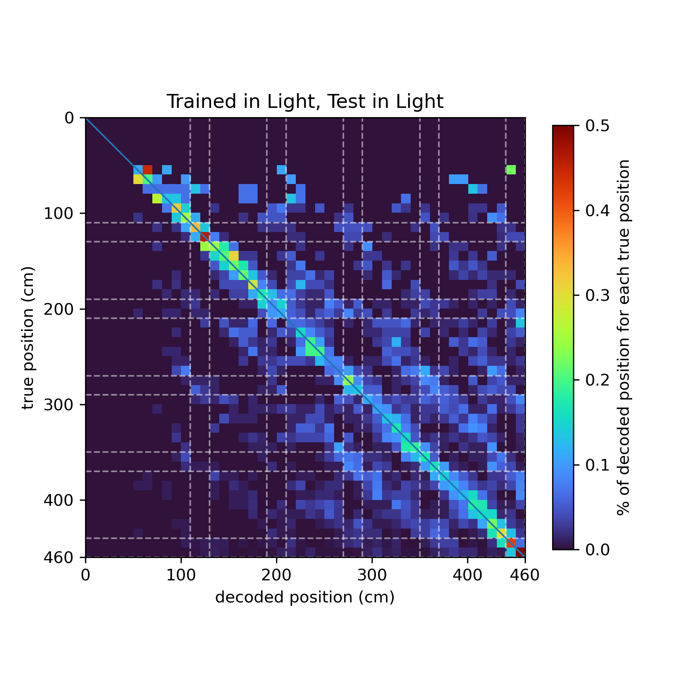
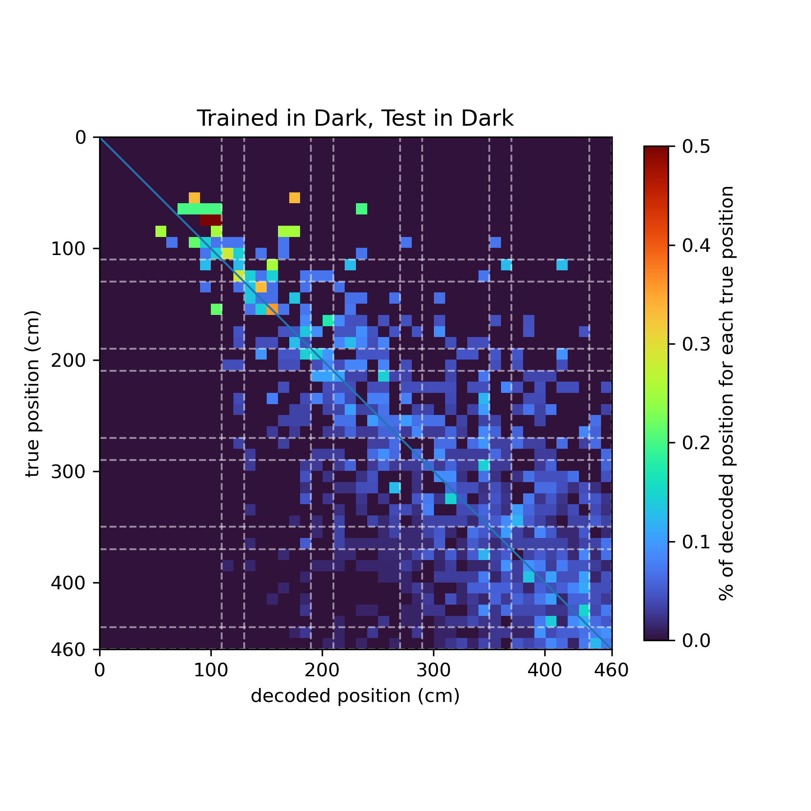

# Bayesian Decoder

This is my dissertation project for my MScR in Integrative Neuroscience.

In essence, I use Bayesian inference to decode the spatial location of mice from their primary visual cortex neural activity, while they were running in a virtual tunnel. This offers preliminary evidence that the mice V1 encode spatial representations both in light and in dark where visual cues are absent.

Full dissertation here:
[Dissertation](https://drive.google.com/file/d/1aufyHlR_6vslDHpS80ekPQCx5uOTfaKf/view?usp=sharing)

### Results from a sample mouse

### Abstract
Reliable spatial representations generated from the hippocampus are important for successful navigation and survival. Previous studies have shown that these top-down spatial representations are encoded in the primary visual cortex (V1) and integrated with bottom-up sensory inputs. However, whether and how V1 maintains these spatial representations in the absence of visual cues remains unknown.

In addressing this research gap, members of the Rochefort Lab utilised a virtual reality navigation task with two-photon calcium imaging to investigate the spatial neural code of mouse V1 in light and dark. It is hypothesised that V1 encodes spatial representations in both light and dark conditions when visual cues are absent.
To test the hypothesis, this thesis developed a decoder based on Bayesian inference to predict the spatial location of the mouse from its V1 neural response. The probabilistic framework of the Bayesian decoder is known to be advantageous in handling noise and uncertainty in the data, thus making it a suitable choice as a decoding methodology. Decoding results showed that the decoder's prediction outperformed chance level estimates in light, and to a smaller degree, in the dark.

The current results offered preliminary support to the hypothesis that spatial representations are encoded in V1 both when the sensory inputs are present, and when they are absent. While it requires further optimisation, the Bayesian decoder is a promising tool that can be applied to datasets from electrophysiological recordings, which would allow more robust testing of the hy- pothesis.
 
