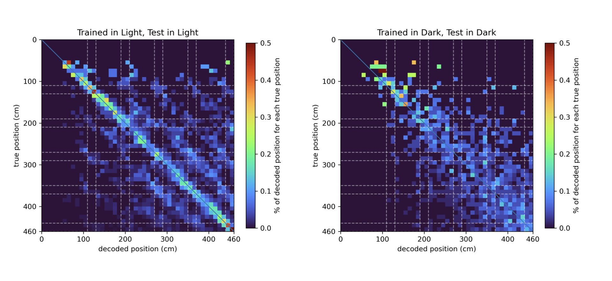

# Bayesian Decoder

This is my dissertation project for my MScR in Integrative Neuroscience at the University of Edinburgh.

> Does mouse V1 cortex encode spatial representations in light and in dark (where visual cues are absent)?

To investigate this, members of the Rochefort Lab utilised a VR navigation task and record mice V1 activity with 2-photon calcium imaging while the mice were running in the virtual tunnel:

As part of this bigger project, I use Bayesian inference to decode the spatial location of mice from their V1 neural activity. This offers preliminary evidence that the mice V1 encode spatial representations both in light and in dark where visual cues are absent.

Full dissertation:
[here](./assets/MScR%20Dissertation.pdf)
(results are not the most updated)

## Demonstration and Results
You can also see a demo of the decoding pipeline
[here](scripts/demo.ipynb).

### Decoder Accuracy and Errors

### Sample confusion matrix in light and dark
